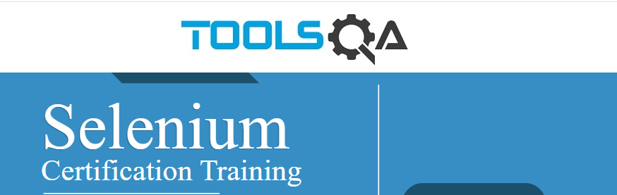
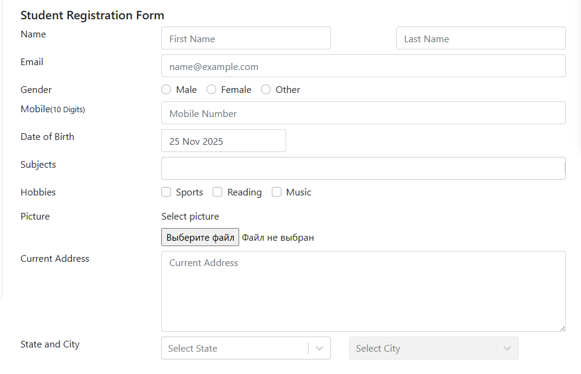
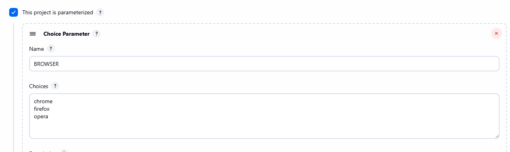
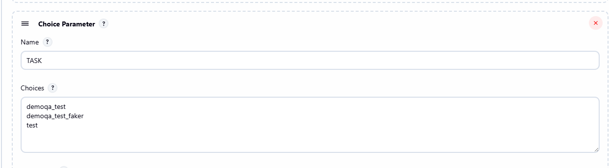
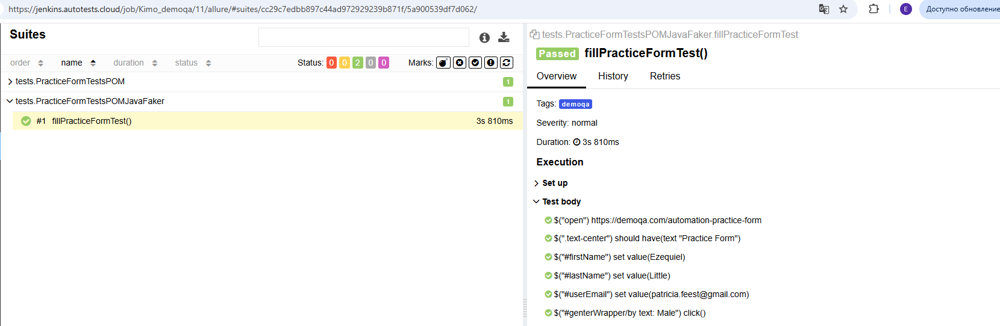
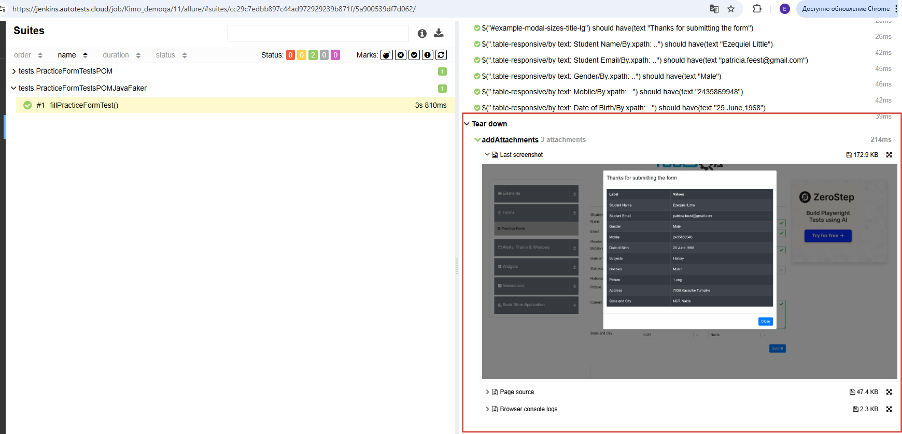

# Проект по автоматизации тестирования приложения demoqa.com


## :pushpin: Содержание:

- [Описание](#open_book-описание)
- [Использованный стек технологий](#computer-использованный-стек-технологий)
- [Запуск тестов](#running_woman-запуск-тестов)
- [Сборка в Jenkins](#-сборка-в-jenkins)
- [Пример Allure-отчета](#-пример-allure-отчета)

## :open_book: Описание
В проекте реализованы UI тесты для формы регистрации https://demoqa.com/automation-practice-form

- PracticeFormTests.java: Базовый тест с открытыми селекторами, без наследования
- PracticeFormTestsPOM.java: Применен Page Object Model и наследование от `TestBase`
- PracticeFormTestsPOMJavaFaker.java:  Добавлен JavaFaker для генерации тестовых данных




## :computer: Использованный стек технологий

<p align="center">
<code></code>
<code></code>
<code></code>
<code></code>
<code></code>
<code></code>
<code></code>
<code></code>
<code></code>
</p>

Автотесты написаны на <code>Java</code> с использованием <code>JUnit 5</code> и <code>Gradle</code>.
Для UI-тестов использован фреймворк [Selenide](https://selenide.org/).
Запуск тестов можно осуществлять локально или в [Selenoid](https://aerokube.com/selenoid/)


## :running_woman: Запуск тестов

### Запуск из терминала (PowerShell)
```
./gradlew demoqa_test 
```
```
./gradlew demoqa_test "-DbrowserSize=1900x1080" 
```
```
.\gradlew demoqa_test "-Dbrowser=firefox" "-DbrowserSize=1900x1080" "-DbaseUrl=https://demoqa.com"
```
Если значения не пререданы, будут использоваться дефолтные ("chrome", "1920x1080","https://demoqa.com")

demoqa_test - будут запущены тесты с тегом  @Tag("demoqa"), для запуска всех тестов использовать test.
Запускать PracticeFormTests.java не требуется, поэтому используем demoqa_test

##  Сборка в Jenkins (Katkimo_demoqa_system)

**Configure:**
- **Используй параметризованную сборку:**
  <p align="center">

</p>

 <p align="center">

</p>

- **Repository:** `https://github.com/EkaterinaMelnikova/demoqa.com_remote_systemProperties.git` *(SCM > Git)*
- **Branch:** `*/main` *(SCM > Branches to build)*
- **Gradle Version:** `Gradle 8.12` *(Build Steps > Invoke Gradle)*
- **Command:** `clean ${TASK} -Dbrowser=${BROWSER}` *(Build Steps > Tasks), так же можно добавить в параметры сборки browserSize и remoteUrl *
- **Allure Path:** `build/allure-results/` *(Allure Report)*


##  Пример Allure-отчета
### Overview

### Результат выполнения теста

Allure-отчет включает в себя:
* шаги выполнения тестов;
* скриншот страницы в браузере в момент окончания автотеста;
* Page Source;
* логи браузерной консоли;
* видео выполнения автотеста.

<p align="center">

</p>

<p align="center">

</p>


